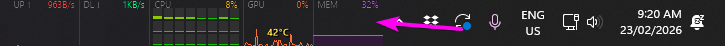

#  task-stats

Little live graphs of your network, CPU, GPU and RAM, right next to the clock

Windows

<!-- media: hero -->
<!--  -->
<!-- /media: hero -->

## What it is

I used to run TrafficMonitor and XMeters on Windows, so I made my own replacement. It sits on the taskbar just to the left of the system clock and draws tiny sparkline graphs for network up and down, CPU, GPU and memory.

The background is see-through so it looks like part of the taskbar, and it stays on top even when you click around. Right-click it if you want to change anything.



## Get it

Paste this into your AI coding agent (Claude Code, Codex, Cursor...):

> Clone https://github.com/mikecann/task-stats and make it my own. It's one of Mike
> Cann's personal tools, so read the README first, change anything specific to his
> setup to suit mine, then help me get it running.

### Or set it up by hand

You'll need Windows, Git and the .NET 10 SDK. NVIDIA drivers provide `nvml.dll` for GPU monitoring; the other graphs work without it.

In PowerShell:

```powershell
git clone https://github.com/mikecann/task-stats
cd task-stats
powershell -NoProfile -ExecutionPolicy Bypass -File .\install.ps1
```

The installer runs `deps.ps1` to check dependencies and build the app if needed. It adds `task-stats.bat`, a Git Bash launcher and `Task Stats.lnk` to `C:\dev\tools`, plus a Start Menu shortcut. It offers to add `C:\dev\tools` to your user PATH if needed. Keep the clone around because the launchers point at it. Use an ASCII-only clone path for the batch launcher.

Open **Task Stats** from the Start Menu, or open a new terminal and run `task-stats`. You can right-click `C:\dev\tools\Task Stats.lnk` to pin it to the taskbar.

No API keys are needed to run the overlay. For the optional AI screenshot judge, install Bun, run `bun install` inside `tests/e2e`, copy `.env.example` to `.env` at this repo's root, and fill in `OPENROUTER_API_KEY`. `TASK_STATS_VISION_MODEL` can be left empty to use the default model. The judge makes paid OpenRouter requests.

## Using it

```text
task-stats          # launch, or click the Start Menu/taskbar shortcut
```

Right-click the overlay for settings, display options and exit. Settings let you choose an adapter, aggregate or per-core CPU graphs, colours, opacity, update interval and whether to run at startup.

## Settings

Settings are stored in `%LOCALAPPDATA%\task-stats\settings.json`. The file includes comments, and the right-click settings dialog edits it for you.

## Development and tests

From the clone root in Command Prompt:

```bat
REM stop the old instance, compile and launch
build-and-run.bat
run-unit-tests.bat
run-integration-tests.bat
run-tests.bat
```

After editing any `.cs` file, rerun `build-and-run.bat`. `build.bat` compiles without launching, and `kill.bat` stops the running instance.

The test projects are console runners with their own assertions. `run-tests.bat` runs the unit and integration suites; `dotnet test` alone does not execute these tests. For deterministic visual checks without an API key:

```powershell
powershell -NoProfile -ExecutionPolicy Bypass -File .\tests\e2e\run-e2e.ps1 -SkipAI
```

`run-e2e-tests.bat` also runs the paid AI screenshot judge. More detail lives in [tests/README.md](tests/README.md). CI builds every .NET project, runs the unit and integration runners, parses every PowerShell script and checks the judge's configuration with a mocked request. It makes no AI calls.

## Architecture

The app builds with `dotnet build` against `net10.0-windows`. Compiled output goes to `%LOCALAPPDATA%\task-stats\task-stats.exe`. `task-stats.vbs` launches the EXE without a console flash; `task-stats.ps1` is a compatibility wrapper.

| File | Purpose |
|---|---|
| `task-stats.csproj` | MSBuild project |
| `src/Native.cs` | Win32 P/Invoke and NVML declarations |
| `src/Settings.cs` | Commented JSON settings |
| `src/SettingsStore.cs` | Settings persistence |
| `src/Metrics.cs` | Circular buffer and PerformanceCounter/NVML sampling |
| `src/OverlayForm.cs` | Layered window, rendering, hit-test and right-click menu |
| `src/SettingsForm.cs` | Tabbed settings dialog |
| `src/App.cs` | DarkRenderer and app entry point |
| `src/Program.cs` | EXE entry point and single-instance guard |
| `icons/` | Embedded famfamfam silk menu icons |

## Troubleshooting

- If the launcher says the app has not been built, run `build.bat` with the .NET 10 SDK installed.
- GPU monitoring needs `C:\Windows\System32\nvml.dll`, supplied by NVIDIA drivers. `deps.ps1` checks for it.
- In exclusive-fullscreen mode the overlay may briefly disappear and return within about 100 ms.

## Uninstalling

```powershell
powershell -NoProfile -ExecutionPolicy Bypass -File .\uninstall.ps1
```

Exit the overlay first. The uninstaller removes this clone's command launchers, shortcuts and startup registration. It keeps your settings and cached build output, and leaves the shared `C:\dev\tools` PATH entry for other tools. Unpin the taskbar shortcut manually if you pinned it.

## Credits

The menu icons are from Mark James's [famfamfam silk icon set](https://www.famfamfam.com/lab/icons/silk/), licensed under [CC BY 2.5](https://creativecommons.org/licenses/by/2.5/). Their original licence still applies.

## More tools

More of my personal tools live at [mikerosoft.app](https://mikerosoft.app).

MIT licensed.
